# draw-design

An **MCP server** that lets coding agents (opencode, Claude Code, …) generate **design-quality diagrams and animations** — C4 architecture diagrams, mind maps, step-animated algorithm visualizations and data-flow diagrams — as self-contained SVGs, GIFs and MP4s. Every generator outputs a consistent **16:9 (1280×720)** canvas by default, so images and videos look uniform in READMEs, docs and slides.

## Generators

| Tool | What it produces |
|------|------------------|
| `generate_architecture` | **C4-style architecture diagrams** (context / container levels) with person, system, database, queue and external-system shapes, color-coded per C4 conventions |
| `generate_mindmap` | **Radial** (root-centered, color-coded rings) or **left-right tree** mind maps from a nested model |
| `animate_algorithm` | **Step-animated algorithm visualizations** — bubble sort as sliding bars, binary search with `lo`/`mid`/`hi` pointers, or your own step script |
| `animate_dataflow` | Self-playing **animated SVG** with travelling packets between nodes |
| `render_diagram` | Graphviz **DOT** or **D2** source → SVG / PNG |
| `record_svg_animation` | Sweep any animated SVG's timeline in headless Chromium and encode with ffmpeg |
| `build_gallery` | An HTML gallery of everything generated (filters + dark mode) |
| `list_engines` / `list_templates` | Report installed backends and available themes / presets / aspects |

Everything is also available as a plain **CLI** (`npm run diagram -- …`).

---

## Screenshots & demos

All images below are 1280×720 (16:9). GIFs autoplay on GitHub.

### Architecture

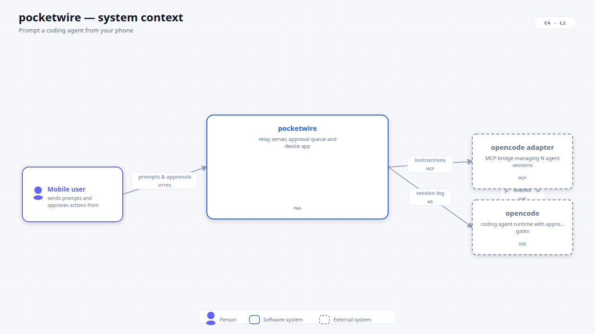

C4 **context** level (top) and **container** level with a dashed system boundary:

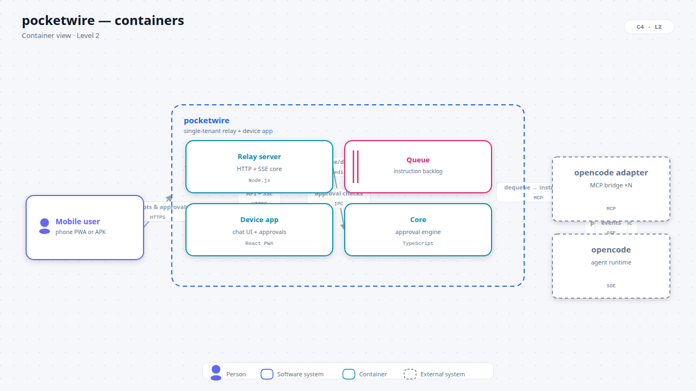

Dark theme, same model:

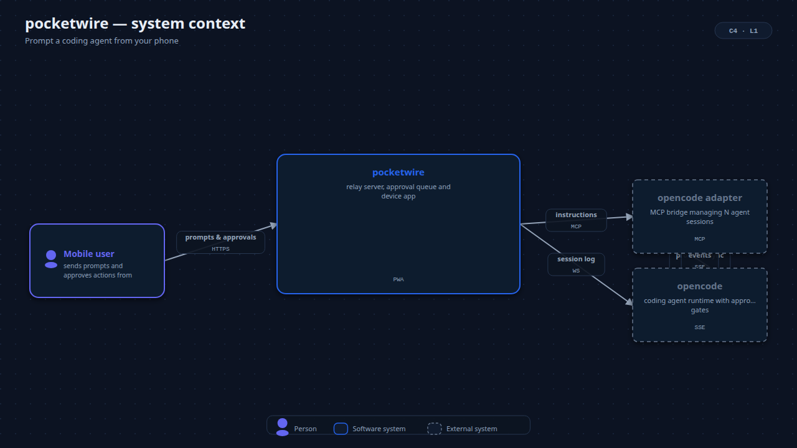

Animated reveal (recorded to GIF):

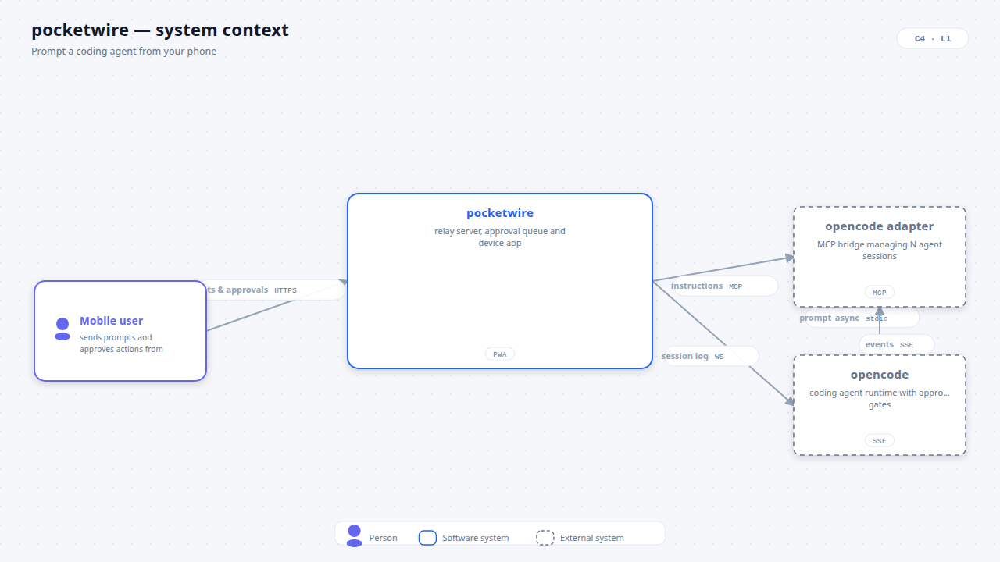

### Mind maps

Radial (root centered, rings by depth, color-coded branches):

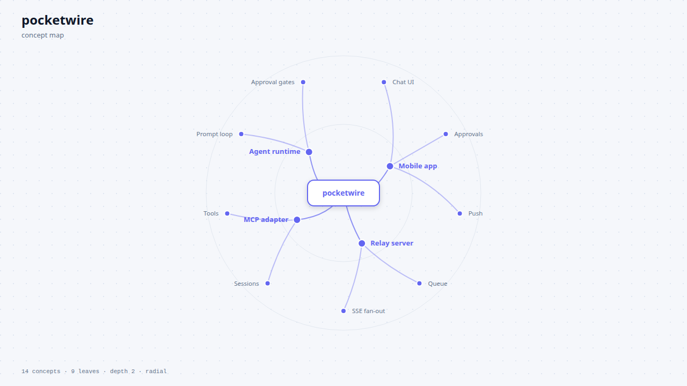

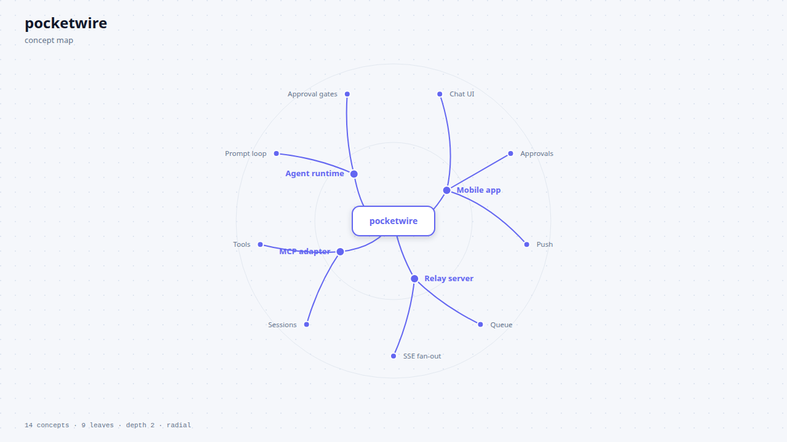

Left-right tree layout:

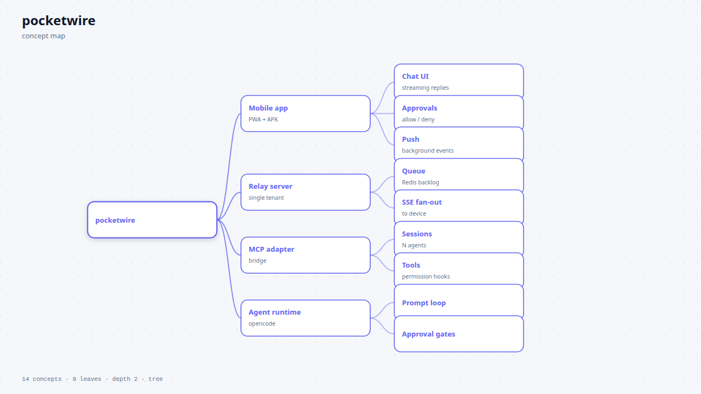

### Algorithm animations

Bubble sort — bars slide into place, colors mark compare / swap / sorted:

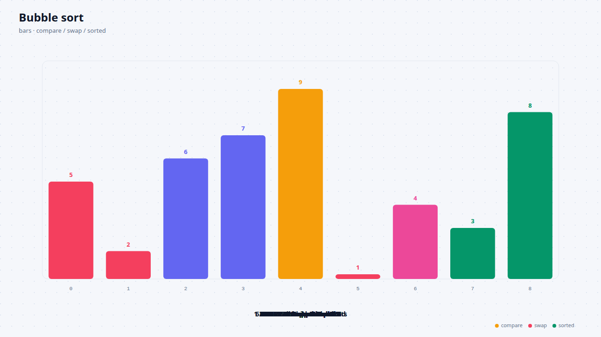

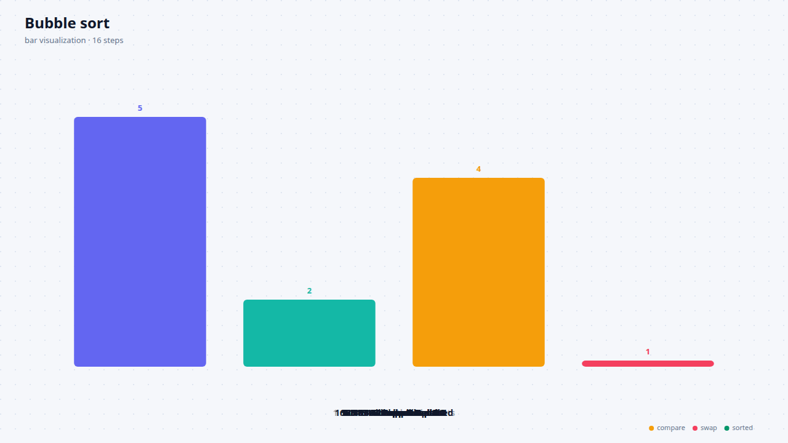

Binary search — `lo` / `mid` / `hi` pointers sweep the array:

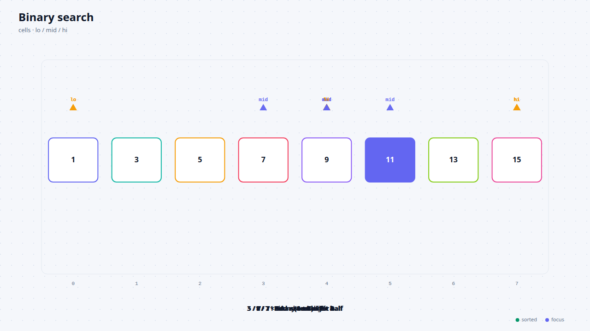

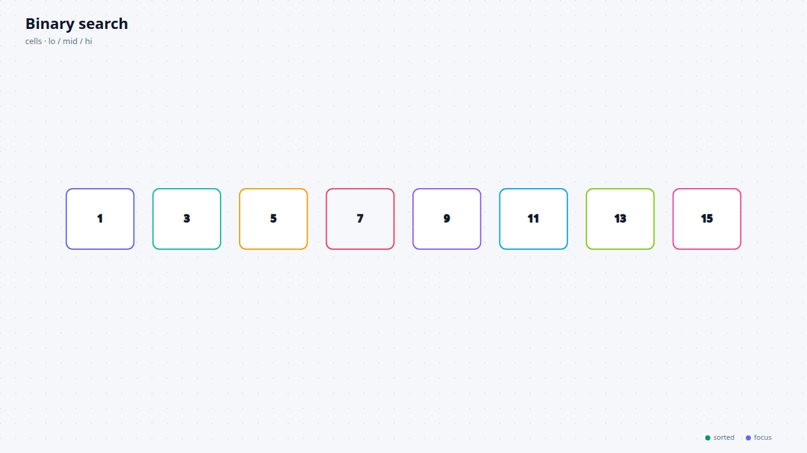

---

## Install

```bash
git clone https://github.com/Prince000101/draw-design && cd draw-design
npm install
npm run diagram -- list-engines
```

### Backends

| Engine | Needed for | Install |
|--------|-----------|---------|
| **Graphviz** `dot` | `.dot`/`.gv` → SVG/PNG | `apt install graphviz` (or brew/dnf) |
| **D2** | `.d2` → SVG/PNG + step-reveal animation | `curl -fsSL https://d2lang.com/install.sh \| sh -s --` |
| **Chromium + ffmpeg** | PNG rasterization, GIF/MP4 recording | reuse cached Playwright Chromium or `npx playwright install chromium`; `apt install ffmpeg` |

The architecture / mind map / algorithm generators are **built-in** — they need no binaries at all.

---

## CLI quick start

```bash
# C4 architecture diagram (16:9, light theme)
npm run diagram -- arch --out examples/out --format png

# Container level, dark theme, recorded to GIF
npm run diagram -- arch --level container --theme dark --format png --record gif --out examples/out

# Mind map — radial or tree
npm run diagram -- mindmap --out examples/out --format png
npm run diagram -- mindmap --layout tree --format png --out examples/out

# Algorithm animations
npm run diagram -- algorithm sort   --values "7,2,9,1,5,3,8,4,6" --format png --out examples/out
npm run diagram -- algorithm search --values "1,3,5,7,9,11,13,15" --target 9 --record gif --out examples/out

# data-flow + GIF
npm run diagram -- animate examples/data-flow.json --gif --out examples/out

# render DOT / D2 sources
npm run diagram -- render graphviz examples/data-flow.dot --out examples/out --format all
npm run diagram -- render d2 examples/data-flow.d2 --out examples/out

# everything + gallery.html
npm run diagram -- demo
```

Open `examples/out/gallery.html` in a browser to view all outputs at once.

---

## MCP usage

Register the server in your agent config, e.g. for opencode (`~/.config/opencode/opencode.jsonc`):

```jsonc
{
  "mcp": {
    "draw-design": {
      "type": "local",
      "command": ["node", "/abs/path/draw-design/node_modules/tsx/dist/cli.mjs", "/abs/path/draw-design/src/index.ts"]
    }
  }
}
```

### Tools

| Tool | Key arguments | Output |
|------|---------------|--------|
| `generate_architecture` | `model` (JSON: `systems[]`, `edges[]`), `level` (`context`\|`container`), `theme`, `aspect`, `format`, `outDir`, `name`, `record` | SVG / PNG path (+ GIF/MP4) |
| `generate_mindmap` | `root` (nested `{label, note?, color?, children?}`), `layout` (`radial`\|`tree`), `title`, `theme`, `aspect`, `format`, `outDir`, `record` | SVG / PNG path (+ GIF/MP4) |
| `animate_algorithm` | `kind` (`bars`\|`cells`), `values[]`, `steps?`, `target?`, `title`, `theme`, `aspect`, `format`, `outDir`, `record` | SVG / PNG path (+ GIF/MP4) |
| `animate_dataflow` | `nodes[]`, `steps[]`, `title?`, `width`, `outDir`, `name`, `record` | animated SVG path (+ GIF/MP4) |
| `render_diagram` | `engine` (`graphviz`\|`d2`), `source` or `sourceFile`, `format`, `outDir`, `name` | rendered file path |
| `record_svg_animation` | `svgPath`, `outPath?`, `seconds`, `fps`, `format?` | recorded GIF/MP4 path |
| `build_gallery` | `outDir` | `gallery.html` path |
| `list_engines` / `list_templates` | — | backend status / template catalog |

Common options on all generators: `aspect` (`16:9` default · `4:3` · `3:2` · `16:10` · `square`), `theme` (`light`\|`dark`), `format` (`svg`\|`png`), `record` (bool, default `false`), `seconds`, `fps`, `videoFormat` (`gif`\|`mp4`).

### Input format for `generate_architecture`

```json
{
  "title": "pocketwire — system context",
  "level": "context",
  "systems": [
    { "id": "user", "name": "Mobile user", "kind": "person", "desc": "sends prompts from the app" },
    { "id": "pocketwire", "name": "pocketwire", "kind": "system", "desc": "relay server + device app", "tech": "PWA" },
    { "id": "db", "name": "Queue", "kind": "queue", "desc": "instruction backlog", "tech": "Redis" },
    { "id": "agent", "name": "opencode", "kind": "external", "desc": "coding agent runtime", "tech": "SSE" }
  ],
  "edges": [
    { "from": "user", "to": "pocketwire", "label": "prompts", "tech": "HTTPS" },
    { "from": "pocketwire", "to": "db", "label": "enqueue", "tech": "Redis" },
    { "from": "pocketwire", "to": "agent", "label": "instructions", "tech": "MCP" }
  ]
}
```

Kinds: `person` · `system` · `container` · `database` · `queue` · `external`. Set `level: "container"` and add a `containers[]` array to a system to draw it as a dashed boundary with nested containers.

### Input format for `generate_mindmap`

```json
{
  "label": "pocketwire",
  "children": [
    { "label": "Mobile app", "note": "PWA", "children": [ { "label": "Chat UI" }, { "label": "Approvals" } ] },
    { "label": "Relay server", "children": [ { "label": "Queue" }, { "label": "SSE fan-out" } ] }
  ]
}
```

### Input format for `animate_algorithm`

Presets: omit `steps` — `bars` runs a bubble sort, `cells` a binary search (`target` required). Or pass explicit steps for full control:

```json
{
  "kind": "bars",
  "values": [7, 2, 9, 1, 5],
  "title": "Bubble sort",
  "steps": [
    { "state": [7, 2, 9, 1, 5], "compare": [0, 1], "label": "Compare 7 and 2" },
    { "state": [2, 7, 9, 1, 5], "compare": [0, 1], "swap": true, "label": "Swap" },
    { "state": [2, 7, 9, 1, 5], "compare": [1, 2], "label": "Compare 7 and 9" }
  ]
}
```

Step fields: `state` (full array), `compare` `[i,j]`, `swap` (bool), `done` / `focus` (index arrays), `pointers` (`[{index, color, label}]`), `order` (permutation for bar sliding), `label` (caption). This generic script covers any step-based visualization — pointer scans, graph traversals, state machines.

---

## How the animations work

1. **SMIL, not JavaScript** — everything runs on the SVG timeline (`setCurrentTime()`), so frames are deterministic and recordable frame-by-frame to GIF/MP4.
2. **Staged reveals** — architecture and mind map elements fade in on a staggered timeline.
3. **Discrete fills + linear transforms** — algorithm bars slide between positions (`<animateTransform>`) while highlight colors change discretely per step (`<animate attributeName="fill" calcMode="discrete">`).
4. **D2 step-reveal** — multi-board D2 sources rendered with `--animate-interval` (see `examples/boards.d2`).
5. **Recording** — headless Chromium screenshots frames while advancing the timeline; ffmpeg encodes the palette GIF or H.264 MP4.

## Design system

- **Consistent canvas** — every generator defaults to **1280×720 (16:9)** so READMEs and videos look uniform; `aspect` and `width`/`height` let you override.
- **Two themes** — `light` and `dark` share one token set (palette, fonts, spacing, arrowheads, shadows).
- **C4 colors** — person (indigo), system (blue), container (cyan), database (violet), queue (pink), external (slate).
- **Deterministic output** — the same model always yields the same pixels, so generated assets are safe to commit and diff.

## Roadmap

- PlantUML backend for state/sequence diagrams
- Interactive HTML "living diagram" export with hover/click
- `build_diagram` from a free-text spec (voice/async orchestration)
- Cloud-hosted rendering fallback when binaries are missing

## License

MIT
